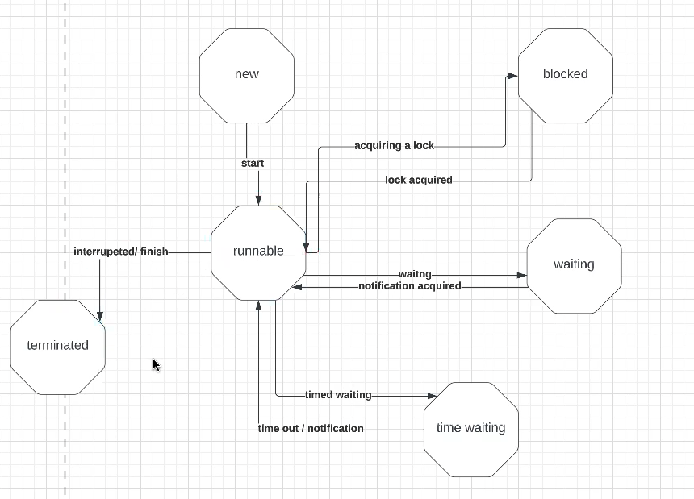

## Day4

### Stream API

#### intermediate operation vs terminal operation

| intermediate operation            | intermediate operation     | 
|-----------------------------------|----------------------------| 
| return stream                     | return other type          | 
| filter,map, flatmap,disinct,limit | collect, foreach, min, max |

#### Thread vs Process

Thread: independent stack, PC register
Process: independent memory space, stack,heap, os resources

#### thread state

new, runnale,blocked, $waiting, time waiting, terminated


#### thread creation

1. **extends Thread**:
2. **implements runnable interface**:
3. **implements callable interface and FutureTask**:
4. **Thread pool**

#### runnable vs. callable

| runnable     | callable      | 
|--------------|---------------| 
| no return    | return        | 
| run          | call          |
| no exception | has exception |

#### thread pool
paramaters: corePoolSize, maximumPollSize, keepAliveTime, unit,workQueue, threadFactory,handler

Certainly! Here's an explanation of thread pools and their usage:

**1. Creating a Thread Pool:**

```java
ExecutorService executor = Executors.newFixedThreadPool(5);
```

In the above code, we're using the `Executors` utility class and its `newFixedThreadPool` method to create a fixed-size thread pool with 5 threads. You can also use other factory methods to create different types of thread pools, such as `newCachedThreadPool()` (variable-sized thread pool) or `newSingleThreadExecutor()` (thread pool with only one thread).

**2. Submitting Tasks to the Thread Pool:**

```java
executor.submit(() -> {
    // Perform the concurrent task here
});
```

Using the `submit()` method, you can submit tasks to the thread pool for execution. Here, we're using a lambda expression to represent the task to be executed, but you can also pass a class implementing the `Runnable` or `Callable` interface.

**3. Shutting Down the Thread Pool:**

```java
executor.shutdown();
```

After all tasks are completed in your application, it's important to shut down the thread pool to release resources. Calling the `shutdown()` method gracefully shuts down the thread pool, waiting for all tasks to complete before shutting down.

**4. Optional Parameters:**

Apart from fixed-size thread pools, you can specify other parameters to control the behavior of the thread pool:

- **corePoolSize**: The number of core threads in the thread pool, i.e., the minimum number of active threads in the pool.
- **maximumPoolSize**: The maximum number of threads in the pool, including both core and extra threads.
- **keepAliveTime**: The idle timeout for non-core threads; extra threads are terminated after reaching this timeout.
- **unit**: The time unit for the keepAliveTime parameter.
- **workQueue**: The task queue used to hold tasks waiting for execution. It can be a bounded queue (e.g., `ArrayBlockingQueue`) or an unbounded queue (e.g., `LinkedBlockingQueue`).
- **threadFactory**: The factory used to create new threads.

By adjusting these parameters, you can optimize the performance and resource utilization of the thread pool according to the requirements of your application.

#### newFixedThreadPool vs newSingleThreadExcutor vs newCachedThreadPool
The `Executors` class in Java provides several factory methods for creating different types of thread pools, each with its own characteristics. Let's compare `newFixedThreadPool`, `newSingleThreadExecutor`, and `newCachedThreadPool`:

1. **newFixedThreadPool:**
    - Creates a fixed-size thread pool where the number of threads remains constant.
    - The pool has a fixed number of threads specified by the `nThreads` parameter.
    - If a thread is idle and there are more tasks than threads, the tasks are queued until a thread becomes available.
    - Suitable for scenarios where you need a fixed number of threads to handle a specific number of tasks concurrently.

```java
ExecutorService fixedThreadPool = Executors.newFixedThreadPool(nThreads);
```

2. **newSingleThreadExecutor:**
    - Creates a single-threaded executor that uses a single worker thread to execute tasks sequentially.
    - Tasks are processed one after another in the order they are submitted.
    - Useful for scenarios where tasks need to be executed sequentially or when you need to ensure thread safety without worrying about concurrent access.

```java
ExecutorService singleThreadExecutor = Executors.newSingleThreadExecutor();
```

3. **newCachedThreadPool:**
    - Creates a thread pool that creates new threads as needed and reuses existing ones when they are available.
    - Suitable for scenarios with a large number of short-lived tasks or when the number of tasks is not known in advance.
    - If a thread is idle for a certain period (specified by the `keepAliveTime` parameter), it may be terminated to reduce resource consumption.

```java
ExecutorService cachedThreadPool = Executors.newCachedThreadPool();
```

In summary:
- Use `newFixedThreadPool` when you need a fixed number of threads to handle a specific number of tasks concurrently.
- Use `newSingleThreadExecutor` when you need tasks to be executed sequentially by a single worker thread.
- Use `newCachedThreadPool` when you have a large number of short-lived tasks and want to optimize thread creation and utilization.


