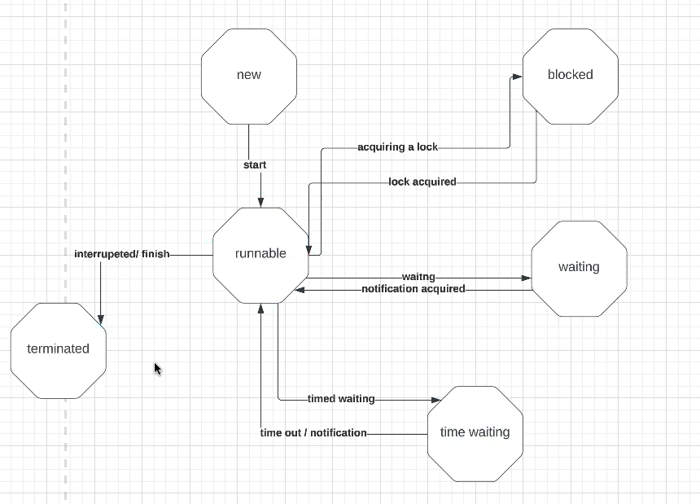

## Day4

- [Stream API](#stream-api)
- [Intermediate Operation vs Terminal Operation](#intermediate-operation-vs-terminal-operation)
- [Thread vs Process](#thread-vs-process)
- [Communication between threads](#communication-between-threads)
- [Thread State](#thread-state)
- [Thread Creation](#thread-creation)
- [Runnable vs Callable](#runnable-vs-callable)
- [Thread Pool](#thread-pool)
- [newFixedThreadPool vs newSingleThreadExecutor vs newCachedThreadPool](#newfixedthreadpool-vs-newsinglethreadexecutor-vs-newcachedthreadpool)

### Stream API

The Java Stream API is a feature introduced in Java 8 that provides a more convenient and efficient way to process collections of data. The Stream API allows developers to perform various operations on collection data in a declarative manner, such as filtering, mapping, sorting, and aggregating, without the need to write cumbersome loops and conditional statements.

The main features of the Stream API include:

1. **Support for Functional Programming**: The Stream API encourages a functional programming style, allowing behaviors to be easily passed to collection elements using lambda expressions, making the code more concise and readable.

2. **Chained Operations**: The Stream API provides a series of operation methods that can be chained together, forming a pipeline-like processing flow. This design makes the code more fluent and enables easier composition of multiple operations.

3. **Lazy Evaluation**: Intermediate operations in Stream operations (such as filtering, mapping, etc.) are typically lazily evaluated, meaning that actual computation is triggered only when encountering a terminal operation. This can improve efficiency by avoiding unnecessary computation.

4. **Support for Parallel Operations**: The Stream API supports parallel streams, allowing for the utilization of multi-core processors to process data in parallel, thus improving processing speed.

5. **Built-in Operations**: The Stream API provides a rich set of intermediate and terminal operations, such as `filter()`, `map()`, `sorted()`, `collect()`, etc., to meet various data processing needs.

In summary, the Java Stream API offers a more concise and efficient way to process collection data, greatly enhancing code readability and development efficiency.

#### intermediate operation vs terminal operation

| intermediate operation            | terminal operation         | 
|-----------------------------------|----------------------------| 
| return stream                     | return other type          | 
| filter,map, flatmap,disinct,limit | collect, foreach, min, max |

#### Thread vs Process

Thread: independent stack, PC register
Process: independent memory space, stack,heap, os resources

Yes, that's a succinct way to differentiate between threads and processes based on their independent components:

**Thread**:
- **Independent Stack**: Each thread within a process has its own stack, which stores local variables, function parameters, and return addresses.
- **Program Counter (PC) Register**: Each thread has its own program counter register, which keeps track of the currently executing instruction within the thread's context.

**Process**:
- **Independent Memory Space**: Each process has its own memory space, which includes code, data, and stack segments. This isolation ensures that one process cannot directly access the memory of another process.
- **Stack and Heap**: Each process has its own stack and heap. The stack is used for storing local variables and function call information, while the heap is used for dynamic memory allocation.
- **Operating System Resources**: Each process is allocated various operating system resources, such as file descriptors, handles, and other system-level resources necessary for its execution.

These independent components contribute to the distinction between threads and processes and have implications for how they interact with each other and with the underlying operating system.

#### Communication between threads
In Java, there are several ways for threads to communicate with each other:

1. **wait() and notify() Methods**:
   - The wait() method causes a thread to enter a waiting state until another thread calls notify() or notifyAll() to wake it up. The notify() method wakes up one waiting thread, while notifyAll() wakes up all waiting threads.
   - Additionally, there is the wait(long timeout) method, which causes a thread to enter a waiting state until another thread calls notify() to wake it up or until the specified timeout period elapses.

2. **join() Method**:
   - The join() method causes one thread to wait for another thread to complete its execution. When one thread calls the join() method on another thread, the current thread will be blocked until the other thread finishes executing.

3. **Lock and Condition Interface**:
   - The Lock interface provides a more flexible locking mechanism compared to the synchronized keyword. The Condition interface provides a more flexible waiting/notification mechanism.
   - Threads acquire locks using the lock() method of the Lock interface and release locks using the unlock() method. Threads can wait for a condition using the await() method of the Condition interface, and other threads can signal waiting threads using the signal() method or wake up all waiting threads using the signalAll() method.

4. **BlockingQueue**:
   - BlockingQueue is a queue that supports blocking operations. When the queue is empty, threads trying to retrieve elements from it are blocked until the queue becomes non-empty. Similarly, when the queue is full, threads trying to insert elements into it are blocked until the queue has space available.

These mechanisms provide different levels of flexibility and are suitable for various scenarios of thread communication and coordination.

#### thread state

new, runnale,blocked, waiting, time waiting, terminated


#### thread creation

1. **extends Thread**:
2. **implements runnable interface**:
3. **implements callable interface and FutureTask**:
4. **Thread pool**

#### runnable vs. callable

| runnable     | callable      | 
|--------------|---------------| 
| no return    | return        | 
| run          | call          |
| no exception | has exception |

#### thread pool
paramaters: corePoolSize, maximumPollSize, keepAliveTime, unit,workQueue, threadFactory,handler

Certainly! Here's an explanation of thread pools and their usage:

**1. Creating a Thread Pool:**

```java
ExecutorService executor = Executors.newFixedThreadPool(5);
```

In the above code, we're using the `Executors` utility class and its `newFixedThreadPool` method to create a fixed-size thread pool with 5 threads. You can also use other factory methods to create different types of thread pools, such as `newCachedThreadPool()` (variable-sized thread pool) or `newSingleThreadExecutor()` (thread pool with only one thread).

**2. Submitting Tasks to the Thread Pool:**

```java
executor.submit(() -> {
    // Perform the concurrent task here
});
```

Using the `submit()` method, you can submit tasks to the thread pool for execution. Here, we're using a lambda expression to represent the task to be executed, but you can also pass a class implementing the `Runnable` or `Callable` interface.

**3. Shutting Down the Thread Pool:**

```java
executor.shutdown();
```

After all tasks are completed in your application, it's important to shut down the thread pool to release resources. Calling the `shutdown()` method gracefully shuts down the thread pool, waiting for all tasks to complete before shutting down.

**4. Optional Parameters:**

Apart from fixed-size thread pools, you can specify other parameters to control the behavior of the thread pool:

- **corePoolSize**: The number of core threads in the thread pool, i.e., the minimum number of active threads in the pool.
- **maximumPoolSize**: The maximum number of threads in the pool, including both core and extra threads.
- **keepAliveTime**: The idle timeout for non-core threads; extra threads are terminated after reaching this timeout.
- **unit**: The time unit for the keepAliveTime parameter.
- **workQueue**: The task queue used to hold tasks waiting for execution. It can be a bounded queue (e.g., `ArrayBlockingQueue`) or an unbounded queue (e.g., `LinkedBlockingQueue`).
- **threadFactory**: The factory used to create new threads.

By adjusting these parameters, you can optimize the performance and resource utilization of the thread pool according to the requirements of your application.

#### newFixedThreadPool vs newSingleThreadExcutor vs newCachedThreadPool
The `Executors` class in Java provides several factory methods for creating different types of thread pools, each with its own characteristics. Let's compare `newFixedThreadPool`, `newSingleThreadExecutor`, and `newCachedThreadPool`:

1. **newFixedThreadPool:**
    - Creates a fixed-size thread pool where the number of threads remains constant.
    - The pool has a fixed number of threads specified by the `nThreads` parameter.
    - If a thread is idle and there are more tasks than threads, the tasks are queued until a thread becomes available.
    - Suitable for scenarios where you need a fixed number of threads to handle a specific number of tasks concurrently.

```java
ExecutorService fixedThreadPool = Executors.newFixedThreadPool(nThreads);
```

2. **newSingleThreadExecutor:**
    - Creates a single-threaded executor that uses a single worker thread to execute tasks sequentially.
    - Tasks are processed one after another in the order they are submitted.
    - Useful for scenarios where tasks need to be executed sequentially or when you need to ensure thread safety without worrying about concurrent access.

```java
ExecutorService singleThreadExecutor = Executors.newSingleThreadExecutor();
```

3. **newCachedThreadPool:**
    - Creates a thread pool that creates new threads as needed and reuses existing ones when they are available.
    - Suitable for scenarios with a large number of short-lived tasks or when the number of tasks is not known in advance.
    - If a thread is idle for a certain period (specified by the `keepAliveTime` parameter), it may be terminated to reduce resource consumption.

```java
ExecutorService cachedThreadPool = Executors.newCachedThreadPool();
```

In summary:
- Use `newFixedThreadPool` when you need a fixed number of threads to handle a specific number of tasks concurrently.
- Use `newSingleThreadExecutor` when you need tasks to be executed sequentially by a single worker thread.
- Use `newCachedThreadPool` when you have a large number of short-lived tasks and want to optimize thread creation and utilization.


