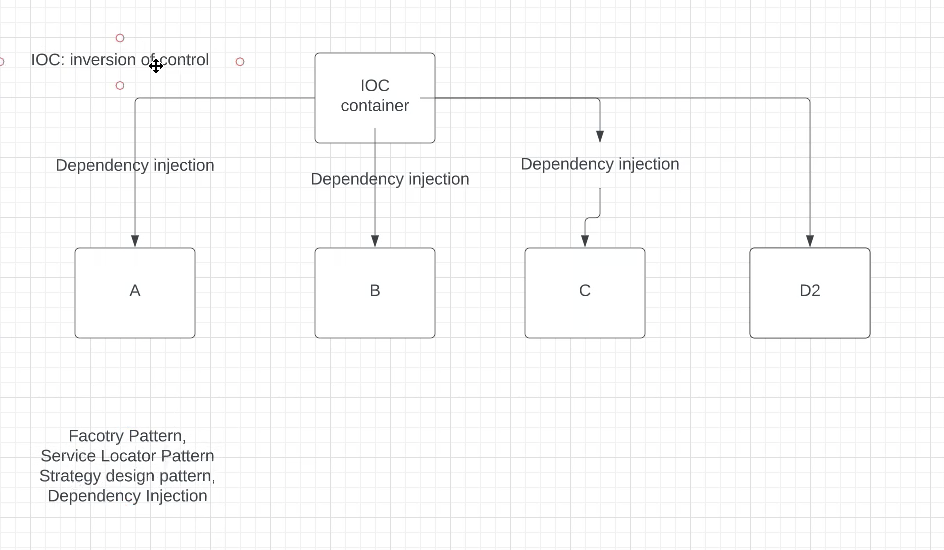
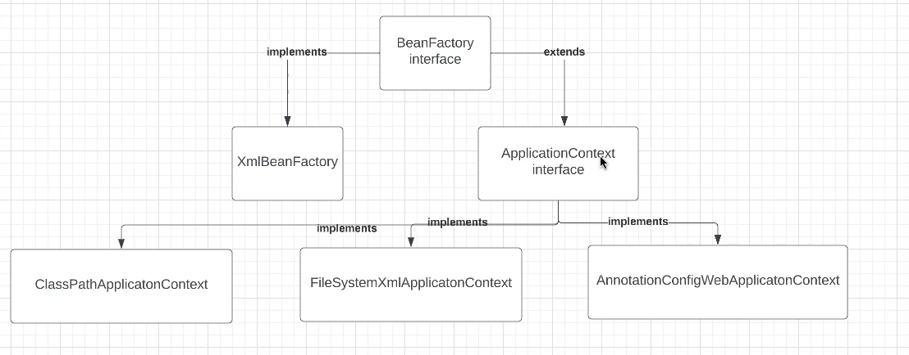
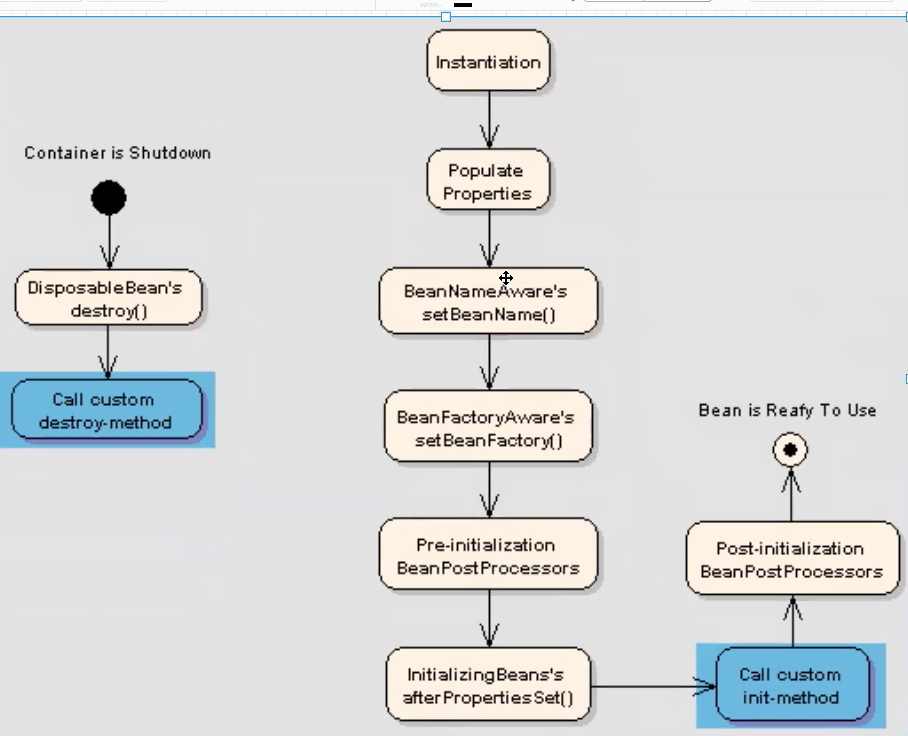

# Day 8
## Spring IOC(inversion of control)

Spring IOC (Inversion of Control) is a core concept in the Spring framework, serving as a design principle to decouple dependencies among components. In traditional programming, components manage their dependencies by creating and maintaining them. However, with an IOC container, control is inverted, and the creation and management of components' dependencies are handled by the IOC container.

In Spring, the IOC container is responsible for creating objects, managing their lifecycle, and maintaining dependencies among them. Through the IOC container, an application can be divided into loosely coupled components, each focusing on specific tasks. This loosely coupled design makes the application more flexible, maintainable, and testable.

The fundamental idea behind Spring IOC is to achieve control inversion through Dependency Injection (DI). Dependency Injection involves injecting the dependencies of an object (other objects it relies on) into it, rather than letting the object create or look up its dependencies. By using Dependency Injection, we can decouple dependencies between components, making their relationships clearer and easier to understand in the codebase.

In summary, Spring IOC facilitates loose coupling of components by implementing control inversion and Dependency Injection mechanisms, thus enhancing the flexibility, maintainability, and testability of the application.


### types of DI
1. Constructor-based DI:
   In constructor-based dependency injection, dependencies are provided to a class through its constructor. When an object of the class is created, the required dependencies are passed as arguments to the constructor. This allows for a clear declaration of dependencies and ensures that an object is fully initialized when it is created.

   ```java
   public class ExampleService {
       private final Dependency dependency;

       // Constructor-based DI
       public ExampleService(Dependency dependency) {
           this.dependency = dependency;
       }
   }
   ```

2. Setter-based DI:
   Setter-based dependency injection involves injecting dependencies into a class using setter methods. After the object is created, setter methods are called to set the dependencies. This approach provides flexibility as dependencies can be changed or updated after the object is constructed.

   ```java
   public class ExampleService {
       private Dependency dependency;

       // Setter-based DI
       public void setDependency(Dependency dependency) {
           this.dependency = dependency;
       }
   }
   ```

3. Field-based DI:
   Field-based dependency injection involves directly injecting dependencies into the fields of a class. This is typically done using annotations such as `@Autowired` in Spring. While field-based DI can lead to concise code, it may make testing more difficult and can introduce tight coupling between classes.

   ```java
   public class ExampleService {
       @Autowired
       private Dependency dependency;
   }
   ```

Each type of dependency injection has its advantages and disadvantages, and the choice between them depends on the specific requirements and design considerations of the application.

### ApplicationContext & BeanFactory

In the Spring framework, ApplicationContext and BeanFactory are both containers responsible for managing and providing beans (objects) to the application. While they serve similar purposes, there are some differences between them.

- **BeanFactory**:
    - BeanFactory is the basic container provided by the Spring framework for managing beans.
    - It provides the fundamental features of bean instantiation, wiring, and lifecycle management.
    - BeanFactory uses lazy initialization, meaning beans are only created when requested.
    - It is suitable for applications with limited resources or where lazy initialization is desired.

- **ApplicationContext**:
    - ApplicationContext is an advanced container that extends the functionality of BeanFactory.
    - In addition to the features provided by BeanFactory, ApplicationContext offers support for internationalization, event propagation, and resource loading.
    - ApplicationContext eagerly initializes singleton beans upon startup, providing faster access to beans when they are first requested.
    - It is suitable for enterprise-level applications where advanced features and performance are required.

In the diagram above, BeanFactory represents the core container functionality, providing basic bean management capabilities. ApplicationContext builds upon BeanFactory, adding extra features such as internationalization and event propagation.

Both ApplicationContext and BeanFactory are essential components of the Spring framework, and the choice between them depends on the specific requirements of the application.

### Bean Scope

1. Singleton (Default):
    - In singleton scope, the Spring IoC container creates only one instance of the bean, and it is shared among all requests.
    - Any subsequent requests for the bean will return the same instance.
    - This is the default scope in Spring.

2. Prototype:
    - In prototype scope, a new instance of the bean is created each time it is requested.
    - Each request for the bean results in a new instance being returned.
    - This scope is useful for beans that need to maintain state or have complex initialization logic.

3. Request:
    - In request scope, a new instance of the bean is created for each HTTP request.
    - The bean instance is destroyed once the HTTP request completes.
    - This scope is typically used for beans that hold request-specific data in web applications.

4. Session:
    - In session scope, a single instance of the bean is created for each HTTP session.
    - The bean instance is maintained throughout the duration of the HTTP session.
    - This scope is suitable for beans that need to maintain state across multiple HTTP requests within the same session.

5. Application:
    - In application scope, a single instance of the bean is created for the entire lifecycle of the application.
    - The bean instance is shared across all users and sessions within the application.
    - This scope is useful for beans that need to maintain global state or perform initialization tasks when the application starts up.

Each bean scope offers different lifecycle and sharing characteristics, allowing developers to choose the most appropriate scope based on the requirements of their application.

### Bean life cycle

1. **Initialization Phase**:
    - During the initialization phase, the Spring IoC container creates a bean instance and performs any necessary configuration.
    - If the bean class has a method annotated with `@PostConstruct`, Spring invokes this method after the bean has been constructed and its dependencies have been injected.
    - The `@PostConstruct` annotated method can be used for any initialization logic that needs to be executed after the bean is constructed.

2. **Destruction Phase**:
    - During the destruction phase, the Spring IoC container destroys the bean instance when it is no longer needed.
    - If the bean class has a method annotated with `@PreDestroy`, Spring invokes this method before destroying the bean.
    - The `@PreDestroy` annotated method can be used for any cleanup or resource release logic that needs to be executed before the bean is destroyed.
      Certainly! `@PostConstruct` and `@PreDestroy` are lifecycle annotations provided by the Spring framework. They are used to execute specific initialization and destruction methods when a bean is being created and destroyed, respectively. Here's a code example demonstrating their usage:

```java
import javax.annotation.PostConstruct;
import javax.annotation.PreDestroy;

public class MyBean {

    @PostConstruct
    public void init() {
        // Initialization logic
        System.out.println("Initializing MyBean...");
    }

    public void doSomething() {
        // Business logic
        System.out.println("MyBean is doing something...");
    }

    @PreDestroy
    public void cleanup() {
        // Cleanup logic
        System.out.println("Cleaning up MyBean...");
    }
}
```

In the above example:
- The `@PostConstruct` annotated method `init()` is executed after the bean is constructed by the Spring container. It's typically used for initialization tasks.
- The `doSomething()` method represents the business logic of the bean.
- The `@PreDestroy` annotated method `cleanup()` is executed before the bean is destroyed by the Spring container. It's typically used for cleanup or resource release tasks.


These annotations (`@PostConstruct` and `@PreDestroy`) provide a convenient way to hook into the bean life cycle and execute custom initialization and destruction logic. They are commonly used in Spring applications to perform tasks such as initializing resources, opening connections, and releasing resources when beans are no longer needed.

### AOP

**Aspect-Oriented Programming (AOP)** is a programming paradigm that aims to increase modularity by allowing the separation of cross-cutting concerns. In Spring Framework, AOP is used to implement cross-cutting concerns, such as logging, transaction management, and security, separately from the core business logic.

#### Aspect
An aspect is a modular unit of cross-cutting concerns in AOP. It encapsulates the advice and pointcuts. In Spring, aspects are implemented as ordinary Java classes annotated with `@Aspect`.

```java
import org.aspectj.lang.annotation.Aspect;
import org.aspectj.lang.annotation.Before;

@Aspect
public class LoggingAspect {

    @Before("execution(* com.example.service.*.*(..))")
    public void beforeAdvice() {
        System.out.println("Before method execution: Logging the method...");
    }
}
```

#### Advice
Advice is the action taken by an aspect at a particular join point. Spring AOP supports five types of advice: `before`, `after`, `after-returning`, `after-throwing`, and `around`.

```java
import org.aspectj.lang.annotation.After;
import org.aspectj.lang.annotation.Aspect;

@Aspect
public class LoggingAspect {

    @After("execution(* com.example.service.*.*(..))")
    public void afterAdvice() {
        System.out.println("After method execution: Logging after method completion...");
    }
}
```

#### Join Point
A join point is a point during the execution of a program, such as method execution or exception handling. In Spring AOP, join points are represented by method executions.

#### Pointcut
A pointcut is a predicate that matches join points. It defines where the advice will be applied in the application. Pointcuts are expressed using expressions.

```java
import org.aspectj.lang.annotation.Pointcut;

@Aspect
public class LoggingAspect {

    @Pointcut("execution(* com.example.service.*.*(..))")
    public void serviceMethods() {}
}
```

#### Target
The target is the class or method where we add the AOP logic. It is the object being advised by one or more aspects.

```java
public class MyService {

    public void doSomething() {
        System.out.println("Doing something...");
    }
}
```

In this example, the `LoggingAspect` aspect intercepts method executions in the `com.example.service` package. It defines a `beforeAdvice` method, which is executed before any method execution in the target package. Similarly, you can define other types of advice and pointcuts to implement different cross-cutting concerns in your application.


