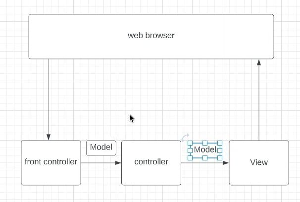
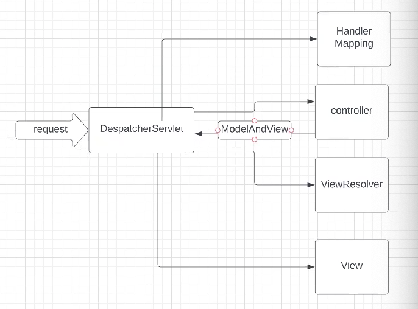

Sure, I can help expand on your notes.

### Spring MVC:
1. **Model/View/Controller (MVC)**:
    - Model: Represents the data of the application and the business logic.
    - View: Represents the presentation layer of the application.
    - Controller: Acts as an interface between Model and View, handles user requests, and returns appropriate responses.

   

2. **DispatcherServlet**:
    - It's the front controller in Spring MVC that receives all incoming requests and dispatches them to the appropriate controllers for processing.
    - It's configured in the `web.xml` file or through Java configuration.

   

### Spring Boot:
**Why Spring Boot?**
1. **Autoconfiguration**:
    - Spring Boot provides automatic configuration based on dependencies present in the classpath, reducing the need for manual configuration.

2. **Dependency Management**:
    - Spring Boot manages dependencies through starter dependencies, which are a set of pre-configured dependencies to simplify the setup of various features.

3. **Embedded Server**:
    - Spring Boot includes an embedded server (Tomcat, by default) which simplifies deployment by packaging the application and server together.

4. **Annotation-Based**:
    - Spring Boot encourages the use of annotations for configuration, reducing the need for XML configuration files and making development more concise.

### REST API Design:
- **CRUD Operations**:
    1. **GET**: `/tickets` - Get all tickets.
    2. **GET**: `/tickets/id` - Get a specific ticket by ID.
    3. **POST**: `/tickets` - Create a new ticket.
    4. **PUT**: `/tickets/id` - Update a ticket.
    5. **PATCH**: `/tickets/id` - Partially update a ticket.

- **URL Design**:
    - URLs should be designed to be intuitive and follow RESTful principles, representing resources and actions clearly.

### Spring Boot Test:
1. **@RequestBody**:
    - Used to bind the HTTP request body with a method parameter in a controller.

2. **@ResponseBody**:
    - Used to annotate methods in a controller to indicate that the return value should be bound to the web response body.

3. **@Controller vs @RestController, @Service, @Repository**:
    - `@Controller`: Marks a class as a Spring MVC controller.
    - `@RestController`: Combines `@Controller` and `@ResponseBody`, primarily used for RESTful APIs.
    - `@Service`: Marks a class as a service component in the business layer.
    - `@Repository`: Marks a class as a repository component for data access.

4. **@PostMapping, @GetMapping, @PutMapping, @PatchMapping**:
    - Annotations for mapping HTTP requests to handler methods based on HTTP methods.

5. **@PathVariable, @RequestParam**:
    - `@PathVariable`: Used to bind a path variable in the URL to a method parameter.
    - `@RequestParam`: Used to bind a query parameter or form data from the request to a method parameter.

These annotations and components help in writing concise and efficient Spring Boot applications, especially for building RESTful APIs.